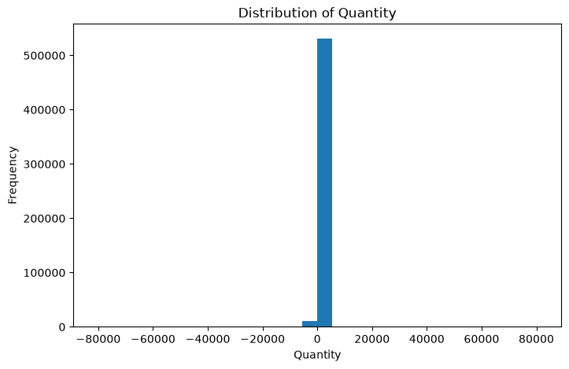
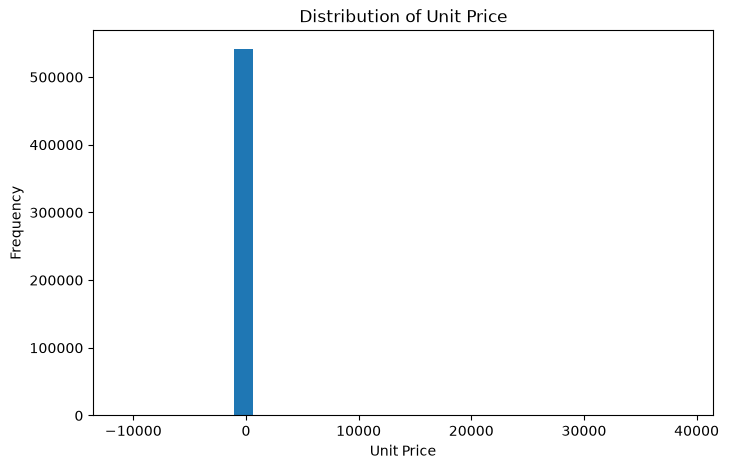

# E-Commerce-Sales-Analysis

## Author
Anjali Kumari

## Project Description
This project analyzes e-commerce sales data to identify sales trends, customer behavior, and business insights using python.

## Tech Stack
- Python
- Pandas
- Numpy
- Matplotlib
- Seaborn
- Jupyter Notebook
- Git
- Github
  

## Problem Statement

The objective of this project is to analyze an E-commerce Sales dataset using Python. The project focuses on understanding the data, cleaning it, performing exploratory data analysis (EDA), and applying feature engineering techniques to prepare the dataset for machine learning.

## Dataset Source

The dataset used in this project is the E-commerce Sales Dataset provided as part of the internship project.

## Approach

The project was completed using the following steps:

- Loaded the dataset using Pandas.
- Explored the dataset by checking shape, columns, data types, and missing values.
- Cleaned the data by handling missing values.
- Visualized the data using charts.
- Created new features such as TotalAmount and Month.
- Encoded categorical variables using Label Encoding.
- Scaled numerical features.
- Split the dataset into training and testing sets.

 ## Charts

### Quantity Distribution

### Unit Price Distribution

## Week 2 Plan

### 3 Core Features
1. Build a basic machine learning model.
2. Evaluate the model performance.
3. Improve the project documentation and GitHub repository.

## Progress So Far till Day 12

### Features Implemented

- Feature 1: Calculate TotalAmount using Quantity × UnitPrice.
- Feature 2: Display the Top 10 Best Selling Products.
- Feature 3: Display the Top 10 Countries by Total Sales.

### Improvements

- Added input validation.
- Added error handling using try/except.
- Tested all core features.
- Fixed bugs found during testing.
- Cleaned and documented the project.

### Current Status

The project is working successfully, and all implemented features have been tested.
